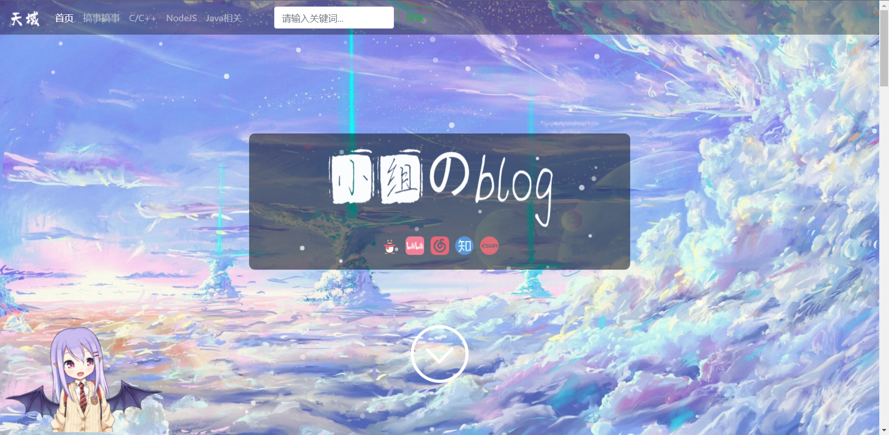
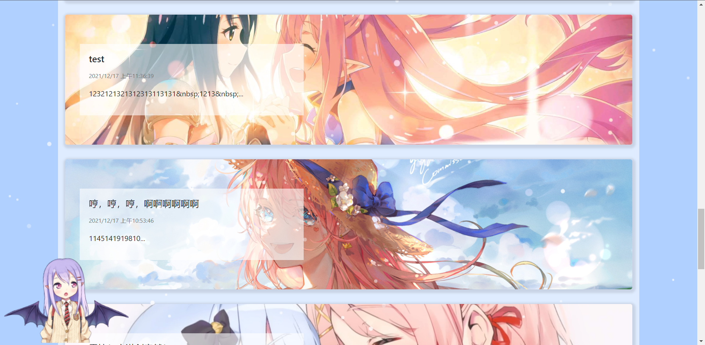

# 简介

简单博客项目,使用了MVC架构,Controller拆分成了中间件层和路由层,中间件层用于处理业务,路由层处理路由用于连接Model层的页面

项目使用技术简介：
本博客项目由Node.js实现,使用了express框架,前端使用了Bootstrap,引入了Cookie-session组件,ejs模板引擎,上传组件multer,数据库使用Mysql,为了增加美观性添加了live2d和雪花特效,在底部添加了新冠地图,每日一词和天气.+
亮点:参考了halo博客的樱花主题https://lixingyong.com/

大致实现了个人博客的功能,可以正式投入使用,但是任需改进

(有两个分支的,可以点开看简约那个分支)

# 使用
导入mysql数据库

在`model/model.js`中更改数据库用户和密码

命令行输入`npm install`

然后执行`node index.js`

访问3000即可

改端口可以在`index.js`的最后一行改

# 目录
 - static,css等静态文件
 - views,放页面模板
 - router,子应用目录,模块化管理
 - middleware,中间件目录,与路由配套的方法,在路由页面加载之前获取一些需要的数据
 - model,操作数据库的文件

# 实现功能
前端展示博客页面

个人社交信息展示

博客页面展示

热门博客置顶

博客分类目录

分类目录展示

全局搜索

特效:live2d,雪花特效,新冠地图,每日一词,天气等

分页

富文本编辑器

登录模块权限管理

发布博客

登录日志

# 效果

